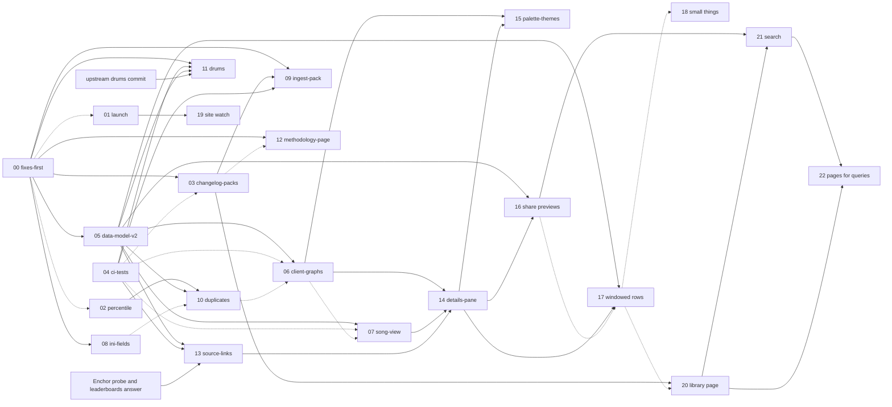

# Fretladder spec: index

This directory is the implementation spec for the fretladder site and the parts of the fretwork pipeline it depends on. It is twenty-five section files, one per piece of work (14 and 15 written after their code, on the maintainer's feedback the evening and the night the first fourteen landed; 16 to 20 written the next morning as the second plan, from the follow-up lists of the first fifteen; 21 and 22 from the maintainer's questions about search, measured on the live site), written on 2026-09-11 against the fork's `main` at `69b5a8f` from subsystem maps of the whole repo and read-only measurements of the Local library. Each section is self-contained: what is true today with `path:line` citations, the design with the alternatives it rejected, the exact interfaces, the files it touches, numbered steps each ending in a check and a commit message, what verifies it, its risks, and what it deliberately leaves out. A future session implements one section at a time, in the order below, and updates this file when it lands. The sections were written in parallel and then reviewed together; where two of them disagreed, the resolution is recorded here under "Decisions that override section text", and that list wins over any sentence in a section file.

Where the site stood when the spec was written, the morning of 2026-09-11: `https://fretladder.com` was live on the `09072026-2031` build pair, tagged `fretladder-v1.0.0` at `963631d`, 20 commits behind `main`. It lists 11,904 charts (10,873 official) from 1,758 songs in 26 packs on three sheets (Guitar 6,610 rows, Bass 5,038, Keys 256). The page is one `index.html` of 1,780,936 bytes, of which the inline `#fw-boot` JSON island is 1,778,082 bytes (99.8%), plus 17 ES modules, `app.css`, Bootstrap and a favicon: 21 requests per cold view, about 350 KB compressed, and because every page file is deployed `no-cache` a repeat visit costs the same 21 requests. Graphs are 11,904 matplotlib PNGs, 2,188,837,822 bytes on disk (median 182 KB, 60 to 468 KB each), rendered at 0.12 s per chart, so a full re-render is about 24 minutes; the one after commit `69b5a8f` (which changed the fingerprint's composition) is still owed and is paid in section 00. Hosting is S3 behind CloudFront on the Free flat-rate plan: 1,000,000 requests and 100 GB a month, no overage billing, so at 21 requests a view the plan is about 47,600 views a month with no graph opened, or about 41,600 at three graphs each, and requests bind long before bytes do. Section 05 takes a cold view to 6 requests and a repeat visit to 1; section 06 retires the PNGs for 47.6 MB of curve JSON. The only traffic so far is the fork's own: 67 GitHub views from 2 visitors in 14 days, 0 issues.

Where the site stands now, after the day's twelve sections (the interim deploys of that day were re-tagged as one release, `fretladder-v1.1.0`, that night; the evening's three pane deploys as `fretladder-v1.2.0`) (`fretladder-v1.1.0` at `c828589`, deployed 2026-09-11 18:53 -0500): the same 11,904 charts (10,873 official) from 1,758 song folders (1,748 distinct by `SongKey`) in 26 packs. `index.html` is 17,331 bytes (6.2 KB compressed) and carries only the manifest; the rows are in `data/<sheet>.<hash8>.json` (Guitar 1,413,089 bytes, 452 KB compressed), the 17 modules are one `static/app.<hash8>.js` of 97,897 bytes, and a cold view of the Guitar sheet is 6 requests and about 530 KB compressed, a repeat visit 1 request (`index.html`; everything else is immutable for a year), with the other sheets and `data/links.<hash8>.json` (104,266 bytes, 1,709 songs) prefetched on idle. Graphs are 11,904 curve JSON files under `graph/`, 47,613,377 bytes (median 3,783), drawn by the page, plus one PNG, the social preview; the 11,903 other PNGs were deleted from the bucket by the v1.7.0 deploy. The night's palette, sheet-switch and library-page work went live as `fretladder-v1.3.0` at `b22121a`, deployed 2026-09-11 23:39 -0500. The share previews and the windowed table went live as `fretladder-v1.4.0` at `19a7a35`, deployed 2026-09-12 00:18 -0500: `song/` holds 1,748 pages, `sitemap.xml` lists 1,753 URLs, and the Guitar sheet's 6,610 rows paint as about a hundred. The search work went live as `fretladder-v1.5.0` at `bda31b9`, deployed 2026-09-12 10:22 -0500: 1,748 song pages that read as pages with their graphs as pictures, 26 game pages, 9 lists, `songs.html`, a sitemap of 1,789 URLs, `www` redirecting to the apex, and Search Console verified on the domain. Drums, vocals and formula v2 went live as `fretladder-v1.6.0` at `1053874`, deployed 2026-09-19 18:28 -0500: 18,807 charts (15,235 official) from 2,272 song folders in 34 packs on five sheets (Guitar 8,781, Bass 5,102, Keys 256, Drums 3,789, Vocals 879), every fret D rescored, 18,807 curve files (version 2) and 2,260 pictures rewritten, 34 game pages, 15 lists. The findability work went live as `fretladder-v1.7.0` at `a6e285f`, deployed 2026-09-19 19:49 -0500: the front page's guide (817 words and 106 links in the raw HTML, one h1), 2,260 song pages titled with their game and no two alike, 34 source pages (games, their DLC and the custom packs) and 14 lists linking each other, a sitemap dated per page, and the first IndexNow announcement (2,314 URLs, answered 200 on the second try; the first, seconds after the key file appeared, was refused with 403, which `deploy.indexnow` now retries once). Open: 13's leaderboards half (the maintainer's answer), section 01's community posts, and 24's off-site half (links from the engine's author, the communities and the hosts; Search Console's Pages report); 11 is closed by 23.

## Sections

| # | Title | Status | Effort | Depends on | Scope |
|---|---|---|---|---|---|
| 00 | [Fixes before anything else](00-fixes-first.md) | Landed (2026-09-11, 6a1830f..60047df) | S | none | Backup CSV header migration (goes upstream as a PR), `difficulty.scorable` so a drums code renders "no graph" instead of a traceback, serve serving `about.html`/`404.html`/`robots.txt`, publish refusing a mismatched cache and xlsx, `page.fill` checking the template not the data, the one owed full re-render, deleting the merged `hosting` branch. |
| 01 | [Launch and feedback loop](01-launch.md) | Landed (2026-09-11, 2eb35f8; tag fretladder-v1.1.0) | S | none (00 before the first data update) | `tools/check_site.py` (ten live checks), README "After it is live" with the CloudWatch commands and the two thresholds, the `fretladder-v1.0.1` tag, the fork's About text, the community post template, two weeks of watching issues and requests. The PR #6 thread is already complete; nothing more is posted there. |
| 02 | [Percentile column](02-percentile.md) | Landed (2026-09-11, 3987d90..ea53f58; tag fretladder-v1.1.0) | S | none (00 step 6 for a zero-render publish) | `Pct` per (sheet, level) computed in `web/frames.py` at page-build time, `rank(method='max')` floored, shown by default after `D`, "At or above 98% of Expert Guitar charts" in the graph heading and the row tip; `percentile(df, distinct)` ready for 10. |
| 03 | [Pack registry and changelog page](03-changelog-packs.md) | Landed (2026-09-11, 15aea0b..229297c; tag fretladder-v1.1.0) | M | 00 | Committed `packs.toml` (26 seed packs, hand-written `[[change]]` entries), `functions/packs.py` (loader, validation, `append_pack`, folder join), an `Added` column, `changelog.html` on a shared `doc.html` template, the strapline linked to it, publish refusing an unregistered folder. |
| 04 | [Tests and CI](04-ci-tests.md) | Landed (2026-09-11, a30e385..948561b; CI green) | L | none | `tests/`: a seeded synthetic 14-song library, `pipeline_test.py` running build, analyze, publish and deploy against a stub `aws`, a headless-Chrome runner with twelve page suites and a 390 px iframe measurement, four `unittest` modules, `deploy.plan()`, `.github/workflows/ci.yml`. |
| 05 | [Data model v2](05-data-model-v2.md) | Landed (2026-09-11, 03f2392..74a1ae4; tag fretladder-v1.1.0) | L | 00 | Rows out of `index.html` into hashed `data/<slug>.<hash8>.json`, one concatenated JS bundle and hashed CSS/favicon/Bootstrap under `static/`, `SongKey` (content hash per song) in cache and xlsx, `graph/<code>.json` curve files with their own manifest, `PREFS_VERSION`, three deploy cache classes with the deferred delete, serve parity through `Built.files`. |
| 06 | [Client-side graphs and compare view](06-client-graphs.md) | Landed (2026-09-11, 03a5af2..0a872a5; page live as fretladder-v1.1.0, the 11,903 PNGs pruned from the bucket by the fretladder-v1.1.0 deploy on 2026-09-11 18:53 -0500, a day early on the maintainer's call) | L | 05 | A canvas renderer from the curve JSON with a hover and keyboard readout, compare of two or three charts (`?code=A&vs=B,C`), pick-from-table, Save as PNG, a real focus trap; publish keeps one PNG (the social preview) and prunes 11,903 in a second deploy a day later. |
| 07 | [Per-song view](07-song-view.md) | Landed (2026-09-11, 625e592; tag fretladder-v1.1.0) | M | 05 | A `#song` panel: every chart of a song as instruments by levels with `D` and `Pct` per cell and the tier per row, opened from the graph heading, a title-cell pip, or `?song=<SongKey>`; stacking rules for three dialogs; "also in" for folders sharing the key. |
| 08 | [Genre, Year and Album](08-ini-fields.md) | Landed (2026-09-11, 15e817d..923e5fe; tag fretladder-v1.1.0) | S | 00 | Three more `song.ini` keys through cache, xlsx and page as hidden columns (Album searchable, Year a range with the `-1` sentinel), the graph fingerprint narrowed to the keys the PNG header prints so the rebuild re-renders nothing, two range-filter fixes. |
| 09 | [Pack ingestion tool](09-ingest-pack.md) | Landed (2026-09-11, 841465a..582c939) | M | 00, 03, 04 | `tools/ingest_pack.py`: archive, folder or direct URL in; staged, sanitised, renamed into `songs/<name>/`; `packs.append_pack`; build and analyze as subprocesses; a summary diff against the previous cache. README section 7 becomes ingest, publish, deploy. |
| 10 | [Duplicate charts](10-duplicates.md) | Landed (2026-09-11, b97837d..ae1f9d5; tag fretladder-v1.1.0) | M | 02, 05 | `notes_hash` per chart at build, hidden `NotesHash` in the xlsx, a page-built `Copies` column, the graph heading listing the other folders with links, percentiles over distinct charts by passing `COPY_KEY` to 02's function. |
| 11 | [Drums readiness](11-drums.md) | Closed by 23 (2026-09-19): upstream chose its own shape (hands, travel and kicks scored separately, a 1x and a 2x reading), so the checklist here was the plan and 23 is what happened | S once unblocked | 00, 04, 05, an upstream commit that does not exist | The checklist for the day upstream scores drums: `difficulty.flat_notes` merging hand and kick at the fork's boundary, a fourth sheet, the eleven strings that say drums are not scored, the fixture and assertion flips. The fork does not fit drums itself. |
| 12 | [Methodology page](12-methodology-page.md) | Landed (2026-09-11, 2b793c1; tag fretladder-v1.1.0) | M | 00 (03 in either order) | `methodology.html` rendered from `Methodology.md` by a stdlib markdown subset that refuses anything it does not know (MathML for the seven formulas), a publish-time check that the calibration tables equal `formula.py`, the explainer and about page linking to it. |
| 13 | [Where to get this chart](13-source-links.md) | Enchor half landed (2026-09-11, dec3b14..efae180; tag fretladder-v1.1.0; the probe said no to the MD5 filter, so the join is metadata, 1,709 of 1,748 songs linked); the leaderboards half still needs the maintainer's answer | M | 04, 05, the Enchor probe, the leaderboards maintainer's answer | `chart_md5` at build, two offline lookup tools writing `caches/<header>_links.json`, a per-song `data/links.<hash8>.json`, two anchors (Chorus Encore, Clone Hero leaderboard) in the graph heading. Step 1 (the probe) and step 2 are Ready today. |
| 14 | [Details pane and the link columns](14-details-pane.md) | Landed (2026-09-11, 9a4add5..3c7eb06; tag fretladder-v1.2.0; three deploys by the maintainer that evening) | L | 06, 07, 13 | The graph and the song grid become one details pane under the table, a region rather than two stacked dialogs: the row is highlighted, the arrows move the chart, the height drags, the caret collapses; a `Chart` column after Artist naming the host the chart is on, general over `labels.CHART_HOSTS`, with the arrow in the cell, and a `Leaderboard` bit beside it, the same links leading the pane's tool row; compare is pick-from-the-table alone; `?song=` an alias for the song's primary chart; a compare legend that names only what differs. |
| 15 | [Palette roles and the two themes](15-palette-and-themes.md) | Landed (2026-09-11, 3361aac; tag fretladder-v1.3.0) | M | 06, 14 | Every colour a role with a value per theme: the brand means only "on", links are one blue, the three curves and the three compare series are separate trios, the level colours read as four, one ground with the canvas painted on it; a light theme following the OS or the header's toggle, decided before the first paint on every page; the contrast audit run in both. |
| 16 | [Share previews and permalinks](16-share-previews.md) | Landed (2026-09-12, 331e71e; tag fretladder-v1.4.0) | M | 05, 14 | A page per song under `song/` carrying the Open Graph tags a shared link needs (title, artist, Expert D, tier and percentile per instrument) and forwarding to the app with the exact chart in its query; a Copy link button in the pane; a stale code falling back to its song; `sitemap.xml`; `song/` as the fourth deploy class, a week. |
| 17 | [Paint only what is on screen](17-windowed-rows.md) | Landed (2026-09-12, c414bf8; tag fretladder-v1.4.0) | L | 05, 14 | The table holds the rows on screen and a margin, with two spacer rows standing for the rest at a measured average height; the view is computed once and the window painted on scroll; the arrow keys, End and a shared code reach rows that are not painted; twelve suites read their expectations from the data instead of the DOM. Measured: 6,610 rows are 112,028 nodes today. |
| 18 | [Small things](18-small-things.md) | Ready | S each | 03, 14 | Six independent items: search folding accents, case and the ampersand; genre spellings folded at page build with a hand table for the rest; a `Pack` column; `?t=` for the readout position and the hardest 30 seconds marked; the pane grip from the keyboard; Download CSV of the current view. |
| 19 | [The live-site watch](19-site-watch.md) | Ready | S | 01 | A daily workflow running `tools/check_site.py` against the live site, one issue per outage with the tool's output, closed by the run that sees it well again; a `--json` flag on the tool; a badge; the CloudFront compression command for the maintainer. |
| 20 | [The library overview page](20-library-overview.md) | Landed (2026-09-11, 0265e58; tag fretladder-v1.3.0) | M | 02, 03, 10 | `library.html`: charts per sheet and level (rows and distinct), Expert charts per tier as bar tables, official against custom, the ten hardest per sheet, the packs; from the same frames the page serves, in `doc.html`, no script; linked from the footer and the explainer. |
| 21 | [Search: the site as a crawler sees it](21-search.md) | Landed (2026-09-12, e8ca2d6; tag fretladder-v1.5.0) | M | 16, 20 | Measured: the front page served 26 words and a table crawlers could not fill (`data/` disallowed), the song pages redirected, nothing linked them, `www` did not resolve. Crawlers may fetch `data/`; a song page is a page (every level of every part, the facts, JSON-LD) that forwards only for a shared link; `songs.html` A to Z in the footer and the library's hardest link to the pages; titles that say what the site is and a tab that names the open chart; check 13 on the tool; Search Console, Bing and `www` written up for the maintainer. |
| 22 | [Pages for the queries people type](22-pages-for-queries.md) | Landed (2026-09-12, a20fef2; tag fretladder-v1.5.0) | M | 16, 20, 21 | A page per pack (`game/<slug>.html`, the setlist ranked by Expert guitar D), the lists per instrument (the hardest official, the hardest customs, the easiest, 100 each), the song page in words with its graph as a picture (publish draws a PNG per song, 1,748), titles and descriptions per document page, `game/` and `list/` in the week class, the library linking all of it. |
| 23 | [Drums, vocals and formula v2 from upstream](23-upstream-drums-vocals.md) | Landed (2026-09-19, a0b4d22..1053874; tag fretladder-v1.6.0, deployed 2026-09-19 18:28 -0500) | L | 00, 05, 06, 12, 20, 22 | The merge of upstream's 38 commits: every D rescored by formula v2, drums (1x and 2x readings) and vocals on the site as two more sheets with graphs the page draws from named lines (curve file v2), one shape for every sheet (`frames.unify`), the methodology check over three modules with upstream's own drift reported on the page rather than fixed, the fixture growing vocals, the eleven strings reworded. |
| 24 | [Findability: getting indexed, and matching the words people type](24-findability.md) | Landed (2026-09-19, c8c7286..a6e285f; tag fretladder-v1.7.0, deployed 2026-09-19 19:49 -0500; the words corrected as fretladder-v1.7.1 at 1f3f198, deployed 20:03: a pack is a source, a game, a game's DLC or a custom pack, never "game"; the on-site half. The off-site half is the maintainer's) | M | 21, 22 | Measured twelve days after launch: nothing indexed by Google or Bing, the front page 18 words and one link without JavaScript, 18,766 query variants of it linked from every page, song titles without the game. The front page carries a section a crawler reads (one h1, the hardest charts, every game and list linked), song and game pages are titled in the query's words, every app link is a fragment, the sitemap's lastmod is per page and honest, IndexNow on deploy, BreadcrumbList, ItemList, WebSite and Dataset blocks, pictures on the lists. The off-site half (links from the engine's author, the communities, the hosts) is listed for the maintainer. |

## Implementation order

Three phases. Every section publishes through section 00's fixes, so 00 is first whatever else moves. Phase 2 starts two weeks after the last community post of section 01, or the day the library passes about 20,000 charts, whichever comes first; a rating report does not move the date (01 Design 8 and 9). The size threshold comes from the measured page: at 150 bytes a row raw the inline island reaches 3.0 MB and the Guitar sheet about 11,000 rows, which is where first paint and every filter change become visible on a phone. Two CloudWatch thresholds also pull 05 forward: 700,000 requests in any 30-day window, or one day over 35,000.

**Phase 1: fix, launch, measure.** `00, 01, 02, 04, 03`.

- 00 first: everything else publishes through it, the one full re-render is paid here, and the backup CSV is fixed before the first new song arrives (09 is what adds one).
- 01 next: no code dependency, the tag and `check_site` exist for every later deploy, and what it collects decides when phase 2 starts.
- 02 before 04: S effort, no dependency, and the planned answer to the largest expected class of rating reports ("412 means what?"); its five suite assertions are handed to 04. Its step 5 expects a zero-render publish, which exists only after 00 step 6.
- 04 before 03: 04 owns `tests/` and every later section (03, 06, 07, 08, 09, 10, 12, 13) adds tests or fixture cases; landing it before them puts those assertions into a real tree instead of a list in a section file. Its own twelve suites run against the bundle as it is today.
- 03 last in the phase: needs 00 only, is needed by 09, and until 05 moves the rows out its `Added` column grows the page by 154,752 bytes, which is accepted.

**Phase 2: the data model and what it enables.** `09, 05, 08, 10, 06, 07`.

- 09 first: it needs 00, 03 and 04, all in phase 1, and it should exist before the first song-pack issue is acted on and before this phase's rebuilds.
- 05 is the phase's gate (01's rule). Run its step 6 rebuild once, carrying 08 step 3 (Genre, Year, Album), 10 step 1 (`notes_hash`) and 13 step 2 (`chart_md5`) in the same `build.py` and `analyze.py` over `songs/`, so the library is built once, not four times. That means the parser and build edits of 08, 10 and 13 are made on the 05 branch before its step 6, each with its own commit; their page and spreadsheet steps follow in their own sections.
- 08 after 05: the 465 KB of new cells lands in the immutable `data/` files rather than `index.html`, and the `PREFS_VERSION` rule has one form.
- 10 after 08 and before 06: it needs 02 and 05; landing before 06 means its heading line takes 06's line-1 slot and 06's `trapTab` reaches its links from the day 06 lands.
- 06 next: two deploys a day apart; retires 2,188,837,822 bytes of PNGs.
- 07 last: needs 05; after 06 so `trapTab`, `findRow`, `loadAll` and the compare button exist once.

**Phase 3: the rest.** `12, 13, 11`.

- 12 needs only 00 and composes with 03 in either order; it sits here because nothing in phases 1 and 2 waits on it, not because it is hard. If phase 2's two-week wait has idle time, 12 is the section to spend it on, right after 03 so `doc.html` and `render_doc` are made once.
- 13's Enchor probe (step 1) can run any time after 04; its build step rides 05's rebuild; the leaderboards half (steps 5 to 8) waits on the maintainer's answer and may never ship.
- 11 is last by definition: blocked on an upstream commit that does not exist.

**Phase 4: the second plan, after v1.3.0.** `16, 17, 19, 18, 20`.

- 16 first: it is the only section that changes whether anyone finds the site, and it is self-contained.
- 17 next, before the library grows rather than after; it is the largest and touches the most suites, and every later section that paints rows (18's `Pack` column, 20's links into the table) lands on the windowed table rather than being adapted to it.
- 19 the same afternoon as either: an hour, and from then on the deploys of 16 and 17 are watched.
- 18 in any order, as idle-time work between the larger ones; its items are independent and each is one commit.
- 20 last: it needs nothing new, and its numbers are more interesting once 16 has brought visitors and the library has grown.
- 21 joined the plan after 16 and 17 shipped: it is what makes 16's pages count, and it lands before 19 and 18.
- 22 follows 21: the pages that match what people type, once a crawler could read the site.
- Not in this plan: `.sng` support (the maintainer does not want it), 11 (upstream), 13's leaderboards half (the maintainer's answer), 01's posts (the maintainer's).

Solid arrows are the `Depends on` line of the target section; dotted arrows are order preferences from the list above (the target still works without the source, but lands more cleanly after it).

## Conventions

**Section format.** Every file has the same headings in the same order: the title line `# NN. Title`, then `**Status:**`, `**Effort:**`, `**Depends on:**`, then `Goal`, `Why`, `Current state`, `Design`, `Data and interfaces`, `Files touched`, `Steps`, `Verification`, `Risks and gotchas`, `Out of scope and follow-ups`, `Open questions`. `Current state` is measured, with `path:line` or `path:symbol` for every claim, and says which tree and which cache it was measured on. `Design` gives the decision and the rejected alternatives. `Steps` are numbered; each ends with the check that proves it and the commit message to use. `Verification` names what section 04's tree must carry for the section. Sections cross-reference each other by number and slug (`section 05`, `data-model-v2`), and a sentence beginning "Section NN must add" is a contract the named section owes.

**Status legend.** `Ready`: can start today on `main`. `Ready after NN`: can start the day section NN lands. `Blocked on upstream`: waits on a commit in `Staycation44/fretwork` that does not exist. `Needs info`: waits on a fact this repo cannot supply (a live experiment, a person's answer). `Landed <sha> <date>`: merged to `main`; write it here when it happens.

**Effort legend.** `S`: a day or less of code, though the runs it needs (a 24-minute publish, a 37-minute lookup) may take longer. `M`: a few days. `L`: a week or more. Each section's own Effort line says what dominates.

**Writing.** No em dashes and no en dashes anywhere, in prose, code comments or commit messages: use a comma, a colon, or a spaced hyphen. British spelling as the repo uses (colour, licence, normalise, catalogue). Plain, specific prose in the voice of `README.md` and `CLAUDE.md`: say what the code does, cite `path:line`, give numbers. Decisions are made, not surveyed. Commit messages are short, informal, one line, merge commits only, as CLAUDE.md prescribes. `labels.py` spells every user-facing apostrophe as `’`; new strings follow that.

**Picking up a section in a fresh session.** Read, in this order: `CLAUDE.md` (the architecture and the rules that must not be broken, including the read-only `songs/` and the virtualenv), this index (the status table, so nothing already landed is redone, and the decisions list below, which overrides section text), section 05 (`data-model-v2`: the shapes every later section builds on, the `Built.files` dict, the manifest, `SongKey`, the curve JSON, the deploy classes; even a phase 1 section names 05 as the thing it must compose with), then the section itself, end to end, before the first edit. Check `git log --oneline -20` against the section's commit messages: a section can be half-landed. Then work the steps in order; each check is the gate to the next step. Run every check that the section says runs against `songs/` or `site/Local/` exactly as written, since there is no test suite until 04 lands and the checks are what stands in for one.

**When a section lands.** Change its Status here to `Landed <short sha> <date>` with the merge commit's sha, and delete the feature branch. Keep `CLAUDE.md` in step: every section's Files touched names the paragraphs it must change, and a landed section whose CLAUDE.md edits were skipped leaves the next session reading stale rules. If a section landed with one of the decisions below applied, or with a departure from its text, note it in one line under the decision or under the section's row. If the section moved a number this index quotes (chart count, requests per view, bytes), update the second paragraph. Do not rewrite the section file to match what was built: it is the record of what was planned; the commit is the record of what was done, and one line here joins them.

**Optional follow-ups.** Every section ends with items marked "Optional follow-up". They are deliberately unimplemented because a fact or a decision is missing, not because they were forgotten; a session must not build one as part of its section. Consolidated here with the thing that would unblock each:

| Section | Follow-up | Unblocked by |
|---|---|---|
| 00 | Backfill `diff_drums` for the 1,758 existing backup CSV rows from the current `song.ini` files | A planned drums write-back before 11; 11 step 3 does this backfill when it lands |
| 00 | `analyze.py:126` keying the drums skip on `difficulty.scorable` rather than the instrument name | Upstream's file; 11 step 1 removes the line altogether |
| 00 | Whether upstream takes the backup-header PR | Resolved 2026-09-11: merged upstream as PR #9 the same day; `backup-header` deleted |
| 01 | A YouTube comment on the explainer video (approved by its author on 2026-09-08) | The user's account and a decision on wording |
| 01 | Posts in the Clone Hero Discord, r/CloneHero, the YARG Discord, the Chorus Encore community | The user's membership and each venue's self-promotion rules, unknown here |
| 01 | A public "Launch, September 2026" tracking issue for the weekly request and byte totals | The user's decision that traffic numbers may sit in a public issue; the default is the tag message |
| 01 | Confirming the budget's three e-mail notifications with `aws budgets describe-notifications-for-budget` | An `aws sso login` and the account id (in the CLI's own error text, not in this spec) |
| 02 | A second percentile, of the Expert `D`, shown on every level like `CalcTier` | A decision that the site wants two percentiles |
| 03 | A `Pack` column from `folder_by_code` | Evidence on the live site that `Release` is too coarse |
| 03 | Linking a pack name to its Enchor or leaderboards page | 13's lookup table |
| 03 | A `changelog.atom` feed | Someone asking for one |
| 03 | Refusing `--search-path .` at build time | A decision on whether upstream's flat library layout should keep building |
| 04 | Committing Bootstrap under `tests/` so CI needs no network | A flaky jsdelivr fetch in CI; not before |
| 05 | Updating `fretladder-leaderboards.user.js` for the manifest shape | A decision to keep the prototype at all; listed under 13 (decision 6 below) |
| 05, 06 | `Compress` on the CloudFront distribution | Resolved 2026-09-11: the query printed `true`, so compressed sheet JSON is what visitors get |
| 05 | A `--dev` serve mode serving the unbundled modules | A need to step-debug that the banner-commented bundle cannot meet |
| 05 | Brotli or gzip pre-compression in S3 | `Compress` proving impossible to enable |
| 06 | Sharing the readout position as `&t=161` | Someone asking |
| 06 | A `render.py` mode writing the curve JSON for engine users | Whether upstream would take it, as a fork PR off `upstream/main` |
| 07 | Per-song Open Graph previews (`song/<key>.html`, 1,748 files) | A decision that the previews are worth 1,748 objects in the bucket; nothing technical is missing |
| 07 | Same-chart marks inside the song grid (Hard is identical to Expert) | 10 landing; read by column name |
| 08 | Genre normalisation (212 spellings) | The genre facet Enchor exposes for the same songs, capturable by 13's probe |
| 08 | Encoding set-filter values that contain a comma in the URL | A backward-compatibility decision on existing shared links; owned by 05 (gap 5 below) |
| 09 | `.sng` unpacking (`tools/sng.py`, a minimal reader, not a dependency) | One real `.sng` from Enchor to check the mask and metadata encoding against |
| 09 | `copies of songs already listed: N` in the ingest summary | 10 landing |
| 10 | A live case for the `Custom`-release fallback in the copies heading | A custom pack re-hosting an official chart in `songs/`, or a custom pair in the fixture |
| 10 | Near-duplicate detection | A similarity measure and a use case; none is known |
| 11 | `pro_drums` and `five_lane_drums` as columns | 08's mechanism; no new information needed |
| 11 | Parsing cymbal markers into the cache | Upstream wanting it; the parsers are shared tooling |
| 11 | The Clone Hero leaderboard's instrument name for drums | 13's live experiment |
| 12 | Stamping the page with the `Methodology.md` blob hash | A decision that publish may shell out to `git` |
| 13 | Updating the userscript (its leaderboard half stays useful after 13) | A decision to keep the prototype; the exact dependencies are in 13 Design 8 (decision 6) |
| 13 | Per-instrument leaderboard links | The query parameters `getScoreLeaderboardQueryParams` emits: open a board, change instrument, read the URL |
| 13 | A view-time Enchor fallback for charts missing from the file | A disclosure on the about page and a cap of one request per opened graph; not wanted while the page promises no third-party requests |
| 13 | Enchor's `noteCounts` as a cross-check of fretwork's `NoteCount` | The registry from 13 step 3 and a 30-line script |
| 13 | `--rekey` for the links registry after a `SongKey`-changing parser change | The first such change |

One item several sections list as a follow-up is already answered: 05's "the account's CloudFront request allowance" is stated in 01 Current state (Free flat-rate plan, 1,000,000 requests and 100 GB a month); 05 should read it from there.

## Decisions that override section text

The sections were reviewed together after they were written, and where they disagreed this list is the resolution. Every item below has been folded into the section files already; the list stays as the record of what was changed and why, so that a question settled here is not re-opened in a section. Numbered so a commit or a row above can cite one.

1. **Page-build column order** (02, 03, 05, 10). After the xlsx columns come `Added`, then `Copies`, then `Pct`, in that order, `Pct` always last. Inside `page.build()` the calls run `frames.with_added` (03), then `add_copies` (10), then `add_percentiles` (02). 03's sentence "appended after every xlsx column and after any page-build column added before it" is replaced by "after the xlsx columns and before `Copies` and `Pct`". 05's boot `columns` example ends `..., "SongKey", "NotesHash", "Added", "Copies", "Pct"`. 02's `tests/test_percentile.py` keeps "`Pct` is last" as the contract.
2. **The link group in the graph heading** (06, 07, 13; superseded by 14: the `.ext` anchors moved to the pane's tool row as buttons and the `.sng` link is gone, so the group holds `.rpt` alone). One wrapper, 07's ``, inside `.mhead` line 1, holding in DOM order 13's two `.ext` anchors, 07's `.sng` link, then `.rpt`. Whichever of 07 and 13 lands first creates it; `ms-auto` moves from `.rpt` to the wrapper then. 13 drops its `.mlinks` span and its post-06 `.gtools` placement; 06's header table is the authority and stays as written.
3. **What 05 must carry for later sections** (01, 03, 05, 12). 05 gains an "Asks from other sections" list when implemented: `changelog.html` (03) and `methodology.html` (12) in the entry class, in `BUNDLE_TOP` and in `bundle.prune_page`; `doc.html` in place of `about.html` in its template list and `assets.REQUIRED`; `packs=` on `page.build` and `changelog_pages` called inside `build()`; `render_methodology()` in `Built.files`; the `columns` example of decision 1; and `tools/check_site.py` checks 11 (every `data/` file the manifest names returns 200 `application/json` and, under `https`, `content-encoding` as check 2 asserts for the page) and 12 (the module script's `cache-control` carries `immutable`), added at 05 step 9. Every `REQUIRED` in 05 is qualified: line 72's is `deploy.REQUIRED` (`('index.html', 'graph/manifest.json')`), line 144's is `assets.REQUIRED`. `BUNDLE_TOP` is defined as "the entry pages (index, 404, about, robots, plus any document page 03 or 12 has added) and the three directories `static`, `data`, `graph`", not as a literal set copied from 05.
4. **`HEADER_META_KEYS` lives in `functions/difficulty.py`** (06, 08, 11), not in `functions/plot.py`, which is upstream's and which the fork does not edit. `bundle.fingerprint` imports it from there and imports nothing from matplotlib. 08 adds the test 06 already uses for plot literals: assert each key in the tuple appears in the source of `plot.meta_header`, its title row or `output_filename`, so the tuple cannot silently drift from what the header prints. If a future edit must put the tuple beside `meta_header`, it goes upstream as a PR from a branch off `upstream/main`, as 00's backup-header change does.
5. **`LEADERBOARD_INSTRUMENT`** (11, 13) lives in `functions/instruments.py` as 13 says. Its import-time assertion and 13's test become "keys are a superset of `SONG_KEY_INSTRUMENTS`", so 11 can add `'drums'` without failing the import. 11 names it `instruments.LEADERBOARD_INSTRUMENT`, not `tools/links_common.LEADERBOARD_INSTRUMENT`.
6. **The leaderboards userscript** (05, 07, 10, 13). No section updates it: it is a prototype outside the repo, it breaks at 05's deploy, and 13 Design 8 says why its fretladder half is redundant once 13 ships. It stays a follow-up under 13 with the exact dependencies 13 lists (read the manifest, fetch `boot.data[sheet].file` per sheet, keep `SongKey`, read `data/links.<hash8>.json`); 07's "re-run the script once" and 10's "with the leaderboards userscript active" check are struck.
7. **The changelog is keyed on the pack folder, not on `SongKey`** (03, 05, 07). 05's Risks sentence "section 03's changelog must key its history on `SongKey` per build pair" and 07's "Section 03's changelog, keyed per build pair, is the record of that" are struck. The rule is 03's: after a change to `parsers/` or `functions/timing.py`, the rebuild gets a hand-written `[[change]]` entry saying the song keys moved and older `?song=` links stop resolving.
8. **The "percentiles move with every update" sentence** (02, 03) is 03's: it writes it into `UI['changelog_intro']` (a static string, conditional on nothing); 02's two mentions point at that.
9. **`frames.COPY_KEY`** (02, 10) is `['Type', 'NotesHash']` and `percentile()` appends `Level` itself; 02 Design 8's "section 10's `KEY` (`['Type', 'Level', 'NotesHash']`)" reads that way.
10. **`render_doc(name, title, body)`** (03, 12) is the signature; `META` is always `meta_head(public=True, canonical=name)`; 12 drops its `public` keyword. `meta_head` also sets `og:url` to the canonical URL for the page being rendered (gap 4 below).
11. **The footer anchor count** (03, 04, 12) is computed in one place, `tests/page/launch.js`, as `1 + <number of document-page links> + FOOTER.length + richLinks(UI.copyright) + 1`, reading the document pages from the boot payload once 12's `DOC_PAGES` reaches it; `test.js` drops its copy. 03 and 12 name `launch.js`, not `test.js` or `links.js`.
12. **Suite counts are never typed** (04, 06, 07, 12). 12 step 6 asserts "every suite green", not `10 suites, 0 failed`; 04's manifest has twelve suites, fourteen after 06, sixteen after 07.
13. **`about.js` exists** (00, 01, 04): injected into `index.html`, it fetches `about.html`; 01's "no `about.js` page suite" defers to 04, and 01's `html.parser` assertions stay as the Python half.
14. **The 390 px measurement** (02, 04, 05, 06, 07, 08, 10, 11, 12, 13). Every section names it `frame.html`; 04 Design 6 states once that if `narrow.js` is the survivor those references read as `narrow.js` (identical assertions), and 12 specifies its second iframe of `methodology.html` for both forms.
15. **`PREFS_VERSION`** (03, 05, 08, 10) is "increment by one" in every section that adds to `DEFAULT_HIDDEN` after 05 has landed, never a literal `2`. The `rangeBody` placeholder change to `v.toFixed(decimals(col))` is 02's; 08 adds the `isMissing` filter to the same line and says so.
16. **`DISPLAY_ORDER` around `Release`** (03, 08, 10), composed once, in 10 as the last to land: `Release, Album, Year, Genre, Added, Copies`; 03 and 08 cite it.
17. **`stream_bytes` and the drums hash** (10, 11). 10's Risks sentence "section 11 says it will make that swap byte-identical" is struck (11's final text rejects the swap for the same reason). 11 describes 10's drums hash as "hand then kick, each half tagged, as `cache.stream_bytes` defines", not "no separators".
18. **Fixture totals are deltas against 04's table** (04, 10, 11): 10 is +1 song, +1 code, +1 Guitar row; 11 is +4 drums codes and a Drums sheet of 6 rows. 04's `test_fixture.py` pins `len(Library.codes)` derived from the table, not a typed number, so the second of 10 and 11 to land needs no re-pin.
19. **Scored instruments are derived, never spelled** (03, 09, 11). 03's helper is `packs.scored_codes`, filtering on `instruments.SCORED_INSTRUMENTS` (the five 5-fret keys, which 11 extends), never on `inst != 'drums'`; 09 counts through the same helper.
20. **Small wording** (02, 07, 09, 10): 10's two `UI` strings use `’`, not `\'`; 07 quotes `UI['pct_of']` ("At or above 98% of ...") rather than "Harder than"; "catalogue" in 02 line 63 and 09 line 73.
21. **02 step 5 and the owed re-render** (00, 02): 02 says "after 00 step 6; if that publish has not run, the first publish here re-renders every graph once".
22. **11's publish assertion** (06, 11) reads "`.png` before 06; `.json` after 05; after 06 only `.json`".
23. **01's tag precondition** (00, 01) is the byte comparison 01 already lists (`diff -rq site/Local/static web/static` reports only the three templates, plus a fresh `publish.py --header Local` writing nothing under `static/` and `index.html` unchanged), not the empty `git log 6ad43be..HEAD` range, which 00's `web/page.py` edits break without changing a published byte. 00 (g) keeps `screenshots` because "the thread is the launch record", 01's reason; no further comment is posted on PR #6.

## Gaps no section covers, with an owner

These came out of the same review as things no section says. Each is assigned; the owning section adds it to its steps when implemented.

1. **The errors CSV path has no test** (`build.py:159-165`, 09's `build errors in pack`, README's "the errors CSV did not jump"). 04's fixture adds one song, `C7 - Broken Mid` in `Fixture Pack C`: a `song.ini` plus a `notes.mid` truncated inside its guitar track, so build records one error and the song is dropped at the join. Expected pins: 15 `song.ini`, 13 cached, 2 "no usable chart/mid", 1 error, one `caches/Fixture_errors_*.csv` with one row; 04 confirms the exact counts on the first run, since the path was never exercised, and 10 and 11 state their deltas against the confirmed table (decision 18).
2. **A folder with both `notes.chart` and `notes.mid`** (chart wins, `build.py:39`) has no fixture case, and 13's `chart_md5` and `source_format` both rest on it. 04's `C2 - Mid Pair` gains a `notes.chart` with different notes beside its `notes.mid`; the pipeline test asserts `source_format == 'chart'` and, after 13, that `chart_md5` is the chart file's.
3. **A folder with a chart but no `song.ini` is dropped silently** (`build.py:66-70`). 09's summary `this pack` block gains `notes without song.ini   N`, counted on the staged tree (directories holding a `notes.chart` or `notes.mid` and no `song.ini`), so the operator sees it before the build does not.
4. **`og:url` on every document page is the site root** because `meta_head` parameterises only `canonical` (`web/page.py:55-58`). 03 fixes it in `meta_head` when it writes `render_doc` (decision 10): `og:url` equals the canonical URL of the page being rendered, and 03's `tests/test_packs.py` asserts it on `about.html` and `changelog.html`; 12's page inherits the fix.
5. **Set-filter values containing a comma do not round-trip** through `url.js:62` (`f.Album=Metropolis, Pt. 2`, `Crosby, Stills & Nash`). 05 owns it, as the section that owns the URL and loading contract: its step 3 decides the encoding (a separator that cannot appear in a value, or commas inside a value percent-encoded twice), keeps old links with unencoded commas reading as they do today, and adds a `roundtrip.js` case with a comma value. Until then the filter works on the page and only the copied link loses it, as 08 says.
6. **`check_site` never checks that `data/*.json` arrives compressed.** Folded into decision 3: 05's check 11 asserts `content-encoding` under `https`, as check 2 does for the page.
7. **`serve.py` writes every on-demand PNG into `renders/`** (`web/graph.py:21`) unless `--out-dir` is passed, and 00 only works around it in its checks. 05 step 7, which reshapes `GraphRenderer` for the curve route, makes serve render into memory and write nothing under `renders/` unless `--out-dir` is given; 06 keeps the `.png` route on that basis.
8. **`timestamp.latest_output` picks by mtime while `check_pair` compares filename stamps.** Folded into 00 step 5, which makes `check_pair` also print a warning when, for either kind, the newest file by mtime is not the newest by filename stamp, naming both files; a copied or touched old cache is then visible in the message rather than inferred from it.
9. **`main` is six commits ahead of `elo`.** Folded into 00 step 7 (branch housekeeping), which adds `git checkout elo && git merge main && git push origin elo`, after the user's go-ahead for the deletes; the rating branch takes `main` periodically and this is the first such merge since the fork settled.
10. **The total rebuild cost of phase 2** is stated nowhere in the sections. It is one `build.py` over `songs/` plus one `analyze.py`, run once at 05 step 6 with 08, 10 and 13's build edits already on the branch (the phase 2 rule above), not four builds. Section 05 records the measured wall time of that build in its step 6 commit message; the README's "several minutes" predates the parallel parsers and 09 says the first ingest measures it.

## Out of scope for the whole spec

- **No backend and no database.** The site is files on S3 behind CloudFront (`deploy.py` is the only code that talks to AWS, through the CLI); everything the page shows is computed at publish time by `publish.py` and served identically by `serve.py`. A per-song route, a search API, a comment store or a live lookup would each need a server, and the hosting design, the Free plan arithmetic in section 01 and the "nothing but numbers, names and graphs" sentence on the about page all rest on there being none. Sections 07 (a panel, not a route) and 13 (resolved offline, read from a file) each rejected the server-shaped version of themselves for this reason.
- **No accounts, no comments, no analytics.** The page makes no third-party request at view time (CLAUDE.md; the YouTube iframe is built only when the panel opens), and the inbound channels are GitHub issues through the two forms. 13's view-time Enchor fallback is a follow-up precisely because it would break that.
- **No JS framework and no Node toolchain.** The page is plain DOM code toggling Bootstrap's own classes, 17 ES modules today and one concatenated bundle after 05, built by a stdlib bundler that refuses anything it cannot prove safe. `requirements.txt` gains nothing for the web layer in any section; `web/markdown.py` (12), `functions/packs.py` (03) and the lookup tools (13) are stdlib for the same reason. Node on the dev box is used only for `node --check`.
- **No scoring changes in the fork.** The engine runs unchanged; `D`, the bins and the tiers are upstream's, and a fix to parsers or formula goes upstream as a PR from a branch off `upstream/main`. Section 11 refuses to fit drums itself for this reason, and 12's drift check exists to prove the site's tables are the engine's.
- **The player rating stays on the `elo` branch and never enters `web/`.** `ScoreData.md` and `SkillRating.md` are research against personal Clone Hero save data; the base site may be hosted publicly, so personal data never enters it. Nothing in these fourteen sections reads a score, and the `elo` branch takes `main` (gap 9), never the other way, until there is code worth shipping.
- **Nothing hosted, ever.** No chart, audio or `.sng` file is stored, mirrored or accepted through the issue form; 09 sanitises every pack before it touches `songs/`, 13 links out and stores an MD5, and `songs/` stays gitignored.
